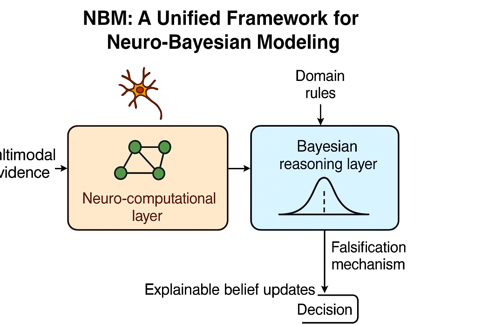

<h1 align="center">
NBM: A Unified Framework for Neuro-Bayesian Modeling
</h1>
<p align="center">


</p>

<p align="justify">
Automatic decision-making in complex environments requires learning systems that can jointly capture human-like perception, multi-level reasoning, and principled uncertainty quantification. However, existing neural or probabilistic approaches typically address these capabilities in isolation, limiting their interpretability, adaptability, and robustness in real-world scenarios. To address these challenges, we propose NBM, a unified Neuro-Bayesian Modeling framework that integrates multi-polar neuron structures with Bayesian inference to support transparent, human-aligned reasoning under uncertainty. NBM introduces a dual-layered learning paradigm: a neuro-computational layer that extracts structured representations from multimodal evidence, and a Bayesian reasoning layer that enforces explainable belief updates guided by domain rules and falsification mechanisms. Through this hybrid design, NBM provides (i) interpretable uncertainty modeling, (ii) robust decision-making under noisy or incomplete observations, and (iii) seamless incorporation of expert knowledge. Experiments across multi-agent collaboration, multimodal prediction tasks, and knowledge-guided inference demonstrate that NBM consistently outperforms purely neural or probabilistic baselines in accuracy, stability, and interpretability. The proposed framework offers a general pathway toward transparent, cognitively inspired AI systems capable of reliable reasoning in safety-critical applications. (A paper abstract generated by AI)
</p>

<p align="center">
 <br>
<b>Figure 1.</b> Structure of NBM.  (A framewok graph generated by AI)
</p>


## Conda Environment Setup

``` shell
conda create --name nbm --file ./requirements.txt
conda activate nbm
```

## Datasets

Here is the English translation of the introduction to **dataset1**, **dataset2**, and **dataset2**:

### **dataset1**

- **Full Name**: xxx xxx xxx Dataset  
- **Source**: xxx xxx xxx .
- **Contents**: xxxx xxxxx.


### **dataset2**

- **Full Name**: xxx xxx xxx Dataset  
- **Source**: xxx xxx xxx .
- **Contents**: xxxx xxxxx.


### **dataset3**

- **Full Name**: xxx xxx xxx Dataset  
- **Source**: xxx xxx xxx .
- **Contents**: xxxx xxxxx.


### Load Dataset

```python

```

## Train

``` python

```

output:

``` shell

```

## Test

``` python

```

output:

``` shell

```
